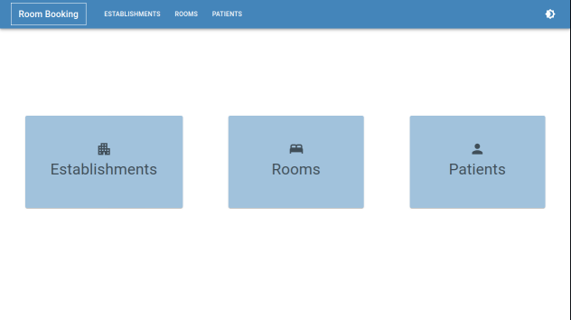

# Room Booking



## Contenu
Dans ce projet se trouve :
* Une application React dans le dossier client
* Un serveur Fastify dans le dossier server

Le but de de projet est de créer une application permettant de gérer une liste d’établissement,
de chambres, de patients et de permettre l’affectation de patient dans des chambres. Pour cela,
nous avons les pages suivantes :

- Liste des établissements. Cette page permet de :
  - Créer un établissement
  - Modifier un établissement
  - Supprimer un établissement
- Liste des chambres. Cette page permet de :
  - Créer une chambre
  - Modifier une chambre
  - Supprimer une chambre
- Liste des patients. Cette page permet de :
  - Créer un patient
  - Modifier un patient
  - Supprimer un patient
  - Affecter un patient à une chambre

## Frameworks
- Front : ReactJS, MUI (Material UI)
- Back : Fastify, MongoDB
- Utilitaires : Docker

## TODO

- [ ] React query --> TanStack Query
	- la librairie [react-query](https://react-query.tanstack.com/) qui va vous permettre de gérer simplement la synchronisation des données avec le serveur
- [ ] React hook form
	- gérer les formulaire avec React et la librairie [React Hook Form](https://react-hook-form.com/).
- [ ] API via des services au lieu des Hooks

## Pré-requis

### Node
Il faut node 20 pour lancer les deux applications. Il est possible d'utiliser nvm pour faciliter l'installation.

### MongoDB
Il faut une base de données mongo pour réaliser l'exercice. Lancer une avec Docker :
```
docker run --rm -it -p 27017:27017 mongo
```
ou dans le répertoire server :
```
npm run mongo:start
```

## Lancement

### Client
Pour lancer le client :
```
cd client
nvm use
npm ci
npm start
```

### Server
Pour lancer le serveur :
```
cd server
nvm use
npm ci
npm start
```

